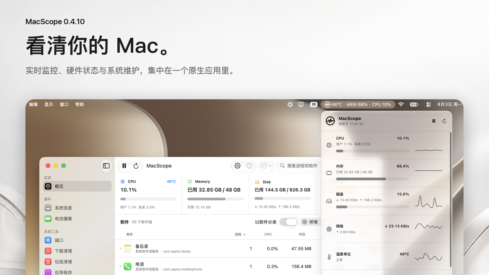

<p align="center">
  
</p>

<h1 align="center">MacScope</h1>

<p align="center">
  <strong>为 macOS 独占打造的轻量系统监控与维护工具</strong>
</p>

<p align="center">
  看清资源占用，管理活跃进程，释放磁盘空间，干净卸载应用。
</p>

<p align="center">
  <a href="https://github.com/shenmuoso/mac-scope/releases"><strong>下载最新版</strong></a>
  ·
  <a href="#核心功能">功能介绍</a>
  ·
  <a href="https://github.com/shenmuoso/mac-scope/issues">反馈问题</a>
</p>

<p align="center">
  
  
  
  
</p>

> [!TIP]
> **0.4.10 新增系统信息、电池健康、端口占用和下载清理。** 集中查看 Mac 硬件与连接状态、电池容量和循环次数，定位监听端口，并安全整理下载文件夹。

MacScope 把一台 Mac 最值得关注的状态集中在一个清爽的原生界面中。它由 SwiftUI 与 AppKit 构建，不包含 Electron、内置浏览器或额外运行时；无需终端、Python 和 Homebrew，安装后即可使用。



## 为什么选择 MacScope

| | 你得到的体验 |
| --- | --- |
| **真正原生** | 标准 macOS 窗口、菜单、表格、设置、授权对话框与深浅色外观 |
| **轻量直接** | 小体积、无额外运行时，不用为了看资源占用再运行一个沉重的网页容器 |
| **信息集中** | CPU、温度、内存、磁盘、网络、进程和清理工具都在同一个应用里 |
| **操作透明** | 扫描结果、文件路径、处理进度和失败原因都清晰可见，删除前由你决定 |
| **本地优先** | 监控与文件分析均在本机完成，不上传系统状态和扫描结果 |

## 核心功能

### 原生菜单栏监控

不必一直把窗口放在桌面上。MacScope 可以常驻菜单栏，用最短的视线距离告诉你 Mac 当前是否繁忙。

- 只显示黑白剪影图标，或紧凑显示最多三个实时指标。
- 自由选择 CPU、内存、磁盘、网络和温度，并调整显示顺序。
- 点击图标展开看板，查看各项指标最近 1 分钟的变化。
- 查看按 CPU、内存、磁盘或网络排序的 Top 进程。
- 自定义看板模块与进程数量；关闭主窗口后仍可继续监控。
- 看板默认采用克制的单色样式，也可以开启“彩色模式”，仅对图表和动态状态使用颜色。

### 实时资源监控

当风扇突然加速、机器发热或网络变慢时，不再靠猜。

- **CPU：** 总占用、用户占用、系统占用与 SoC 温度。
- **内存：** 已用、总量、可用量与实时占用比例。
- **磁盘：** 数据卷容量、读取速率和写入速率。
- **网络：** 实时下载与上传速率。
- **动态状态色：** 根据占用率、网速和温度区间快速识别当前状态。
- **灵活刷新：** 支持暂停、立即刷新，以及 `0.5`、`1`、`2`、`5` 秒刷新频率。

### 进程监控与管理

一个表格看清是谁正在消耗你的 Mac，并直接采取行动。

- 集中查看进程名称、PID、CPU、内存、磁盘读写、网络上下行、线程数和运行时间。
- 点击任意表头升序或降序排序，快速找到资源占用最高的进程。
- 区分系统软件或服务、已安装软件、插件或工具及其他来源，并支持来源筛选。
- 按软件分类关联进程，汇总 CPU、内存、磁盘与网络占用，展开后可继续按表头排序子进程。
- 按进程、软件名称、Bundle ID 或 PID 搜索，Top 行数可设置为 5、10、20 或 50。
- 双击进程打开详情，查看最近 1 分钟的 CPU、内存与 I/O 趋势。
- 支持正常退出与强制退出，并在执行前进行确认。

### 系统硬件与电池

快速查看当前 Mac 的硬件、显示器和连接状态，不必在系统报告的层级中逐项查找。

- 显示 Mac 型号、芯片、架构、CPU 核心、内存、系统版本、运行时间和热状态。
- 列出内置与外接显示器的分辨率、像素分辨率和主显示器状态。
- 查看 USB 设备、蓝牙控制器与已连接设备，以及 Wi-Fi 接口、信号、速率和信道。
- MacBook 可查看当前电量、最大容量、设计容量、循环次数、电池状态和充放电功率。
- 不支持的硬件字段会保持不可用，不会用估算值冒充真实读数。

### 端口与下载工具

- **端口占用：** 查看当前 TCP 和 UDP 监听端口、地址、PID、进程与所属软件；支持筛选、复制、打开本机地址和结束进程。
- **下载清理：** 分类扫描安装包、压缩包、重复下载、不完整下载、大文件和旧文件。
- 重复下载通过内容哈希确认，并确保每组至少保留一份。
- “推荐选择”只勾选不完整下载、较旧的安装包或压缩包，以及重复文件中的旧副本。
- 下载文件始终经过用户确认后移到废纸篓，不会自动永久删除。

### 垃圾扫描与清理

清理不是一个模糊的“立即加速”按钮。MacScope 会先告诉你找到了什么，再由你决定删除什么。

- 扫描用户缓存、日志、诊断报告和开发者文件。
- 按类别查看大小、路径和具体项目，并支持逐项选择。
- 清理时显示当前文件与总体进度；完成后以紧凑摘要呈现结果，逐项状态、路径和失败原因可在独立结果窗口中查看。
- 缓存可设置为移到废纸篓或永久删除，默认采用更稳妥的废纸篓模式。
- 无法处理的项目保留明确原因，解决权限问题后可以重试。

### 应用卸载与残留清除

卸载应用不应只把一个图标拖走。MacScope 将应用本体与相关数据放在同一个确认流程中处理。

- 扫描标准应用目录并显示应用状态、位置和大小。
- 识别 Bundle ID、相关数据以及系统中已注册的其他应用副本。
- 在独立确认界面中检查应用本体和每一项残留文件。
- 显示卸载路径与实时进度；完成后的成功结果、失败原因和权限处理入口集中在独立结果窗口中。
- 卸载 `/Applications` 中的受保护应用时，确认后立即显示 macOS 原生管理员授权对话框，不再先失败再重试。
- 先确认应用本体能够移除，再处理相关数据，避免留下一个被清空数据但仍存在的应用。

### 磁盘与资源管理

空间去了哪里，MacScope 帮你把答案列出来。

| 工具 | 用途 |
| --- | --- |
| **大文件** | 在指定文件夹中查找超过阈值的文件，按大小快速定位空间占用 |
| **重复文件** | 通过文件大小和内容哈希确认重复项，并确保每组至少保留一份 |
| **快速内存释放** | 通过 macOS 原生管理员授权请求系统回收符合条件的非活跃文件缓存，不关闭正在运行的应用 |

大文件和重复文件默认扫描当前用户的 `Downloads`、`Desktop`、`Documents` 和 `Movies`，也可以在设置中添加或移除扫描目录。

## 常见使用场景

- **Mac 突然发热：** 按 CPU 排序，找出持续高占用的进程，再查看它最近 1 分钟的活动。
- **内存压力升高：** 按内存排序确认主要占用者，必要时使用快速内存释放。
- **磁盘空间不足：** 依次检查垃圾、大文件和重复文件，把可回收空间变成清晰列表。
- **应用卸载不干净：** 选择应用，同时检查相关数据和其他副本，再统一确认处理。
- **只想快速看一眼：** 在菜单栏显示 CPU、内存或网速，不必打开主窗口。
- **端口被占用：** 输入端口号找到对应软件，打开本机地址或结束相关进程。
- **下载文件太乱：** 分类检查安装包、压缩包、重复下载和旧文件，再决定移除哪些项目。
- **确认硬件状态：** 集中查看芯片、内存、显示器、无线连接和电池健康信息。

## 下载与安装

1. 前往 [GitHub Releases](https://github.com/shenmuoso/mac-scope/releases) 下载最新的 `MacScope-*.dmg`。
2. 打开 DMG，将 `MacScope.app` 拖入 `Applications` 文件夹。
3. 从“应用程序”启动 MacScope。

> [!IMPORTANT]
> 当前 Release 使用 ad-hoc 开发签名，尚未完成 Apple Developer ID 公证。请只打开从本仓库 Releases 页面下载的安装包。MacScope 不会要求你在应用自己的界面中输入管理员密码。

### 首次打开 MacScope

如果 macOS 提示无法验证开发者或阻止打开，请按以下步骤操作：

1. 确认已经将 `MacScope.app` 拖入“应用程序”文件夹，并尝试打开一次。
2. 在系统提示中点击“完成”或关闭提示窗口。
3. 打开苹果菜单，进入“系统设置 > 隐私与安全”。
4. 向下滚动到“安全性”，找到 MacScope 被阻止打开的提示。
5. 点击“仍要打开”，使用 Touch ID 或管理员密码确认。
6. 在最后的确认窗口中再次点击“打开”。以后启动同一构建通常不再需要重复这些步骤。

也可以在 Finder 的“应用程序”文件夹中右键 `MacScope.app`，选择“打开”，然后在确认窗口中再次选择“打开”。替换不同的 ad-hoc 签名构建后，macOS 可能要求重新确认。

## 个性化设置

界面偏好使用 macOS `UserDefaults` 持久化；登录启动和隐私权限由 macOS 管理。

| 类别 | 可配置内容 |
| --- | --- |
| **监控** | 0.5/1/2/5 秒刷新频率、Top 5/10/20/50、摄氏度或华氏度 |
| **菜单栏** | 开关、仅图标或紧凑数据、最多三个指标、模块顺序、进程排序与数量、彩色模式 |
| **外观** | 跟随系统、浅色、深色、主题、原生透明侧栏、侧栏透明度和两套 Dock 图标 |
| **清理** | 缓存处理方式、清理前确认、大文件阈值、重复文件阈值、下载文件时间范围和扫描目录 |
| **权限管理** | 登录时自动启动、完全磁盘访问设置和按需管理员授权说明 |
| **语言** | English 或简体中文；默认使用 English |

设置文件由系统保存在：

```text
~/Library/Preferences/com.shenmuoso.macscope.plist
```

## 隐私、权限与安全

- 系统指标、进程信息和扫描结果只在本机处理，MacScope 不上传这些数据。
- 文件默认移到废纸篓，MacScope 不会自动清空废纸篓。
- 应用、应用残留、大文件和重复文件始终移到废纸篓，不会直接永久删除。
- 下载清理只扫描当前用户的 `Downloads`，清理前始终展示分类、路径、大小和修改时间。
- 只有可重建缓存和开发者文件可以在设置允许时永久删除。
- 某些用户资源库路径需要“完全磁盘访问权限”，可从“设置 > 权限管理”打开对应系统设置。
- 移除受保护应用或释放文件缓存时，MacScope 会在执行前立即显示 macOS 标准管理员授权对话框。
- MacScope 不读取、不接收也不保存管理员密码。
- 扫描会跳过符号链接和应用包内部，避免越过用户选择的目录边界。

### 开启完全磁盘访问权限

1. 打开 MacScope 的“设置 > 权限管理”，点击“打开完全磁盘访问设置”。
2. 在系统设置列表中打开 MacScope 右侧的开关。
3. 如果开关已经打开但权限仍未生效，请选中 MacScope 并点击列表下方的 `−` 删除，再点击 `+` 重新添加 `/Applications/MacScope.app`。
4. 退出并重新打开 MacScope。

当前版本采用 ad-hoc 签名。替换不同构建的测试包后，macOS 可能仍显示旧授权条目，但新程序身份已发生变化，因此可能需要执行一次删除并重新添加。

## 系统要求

- macOS 13 Ventura 或更高版本。
- 当前 GitHub Release DMG 面向 Apple Silicon Mac；Intel Mac 可以使用匹配的 Swift 工具链从源码构建。
- 原生应用无需 Python、Textual、Homebrew 或其他运行时。
- 温度读取依赖当前机型和 macOS 暴露的 IOHID 传感器。温度显示“不可用”时，其他监控功能仍可正常工作。

## 常见问题

### 为什么首次采样的 CPU、磁盘或网络速率是 0？

速率需要比较前后两次系统计数才能计算。等待一个刷新周期后即可显示实时值。

### 为什么有些文件显示需要完全磁盘访问权限？

macOS 会保护部分用户资源库目录。MacScope 只会明确提示权限问题，不会绕过系统保护；授权后重新扫描即可。

如果系统设置中的 MacScope 开关已经打开但扫描仍受限，请删除该权限条目，重新添加 `/Applications/MacScope.app`，然后退出并重新打开 MacScope。

### 管理员授权时，MacScope 会看到我的密码吗？

不会。密码输入框由 macOS 提供，认证过程由系统处理，MacScope 只接收操作是否获准的结果。

### 为什么温度显示“不可用”？

不同 Mac 和 macOS 版本暴露的传感器不同。这不影响 CPU、内存、磁盘、网络和进程监控。

## 从源码构建

需要 macOS 13+、Xcode Command Line Tools，以及推荐的 Swift 6 工具链。

```bash
git clone git@github.com:shenmuoso/mac-scope.git
cd mac-scope
native/scripts/run_app.sh debug
```

只构建原生 App：

```bash
native/scripts/build_app.sh release
```

构建可发布的 DMG：

```bash
native/scripts/build_dmg.sh release
```

默认输出：

```text
native/build/MacScope-0.4.10.dmg
```

仓库仍保留早期 Python/Textual 终端版本用于兼容与历史参考，但它不是当前原生应用的运行依赖。

## 项目与反馈

- [下载与历史版本](https://github.com/shenmuoso/mac-scope/releases)
- [提交问题或功能建议](https://github.com/shenmuoso/mac-scope/issues)
- [项目主页](https://github.com/shenmuoso/mac-scope)
- [作者主页](https://github.com/shenmuoso)
